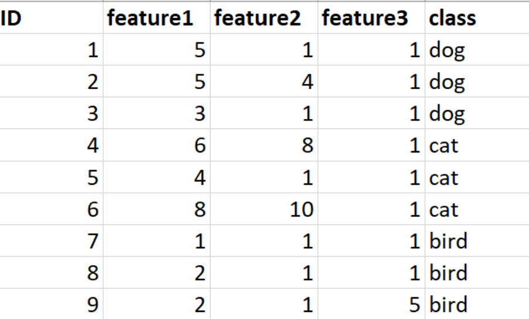

# DV

---

### About:

---

This application displays n-Dimensional data in 2D using GLC-L coordinates.
For better class separation, linear discriminant analysis is used to get the optimal angles and threshold for a visualization.
Adjustments to the angles and threshold can be done by using the related slider.
Graphs produced by this program can be panned, zoomed in/out, and scaled.
Graph order can be rearranged.
Analytics generated by this program include the "All Data," "Data Without Overlap," "Overlap Data," and "Worst Case," confusion matrices as well as k-fold cross validation.

 
Please refer to the user manual for specifics on any of the information above.

### Dataset Information:

---

- Dataset must be in .csv format
- Dataset must include a header row
- If there is an ID column, it must be first
- If there is a class column it must be last
- Dataset features besides "class" must be numeric

### Example Dataset:

---

### Requirements:

---

Windows

### Install and Run:

---

1. Download DV.zip
2. Unzip DV.zip
3. Run "DV.exe"
4. Follow instructions in "Run Instructions"

### Dataset Links:

---

[Iris dataset](https://archive.ics.uci.edu/ml/datasets/iris)
 
[Breast Cancer Wisconsin (Original) dataset](https://archive.ics.uci.edu/ml/datasets/breast+cancer+wisconsin+%28original%29)

### Visualizations:

---

#### Iris dataset Iris-setosa (upper graph) vs Iris-versicolor and Iris-virginica (lower graph)

#### Breast Cancer Wisconsin benign (upper graph) vs malignant (lower graph)

